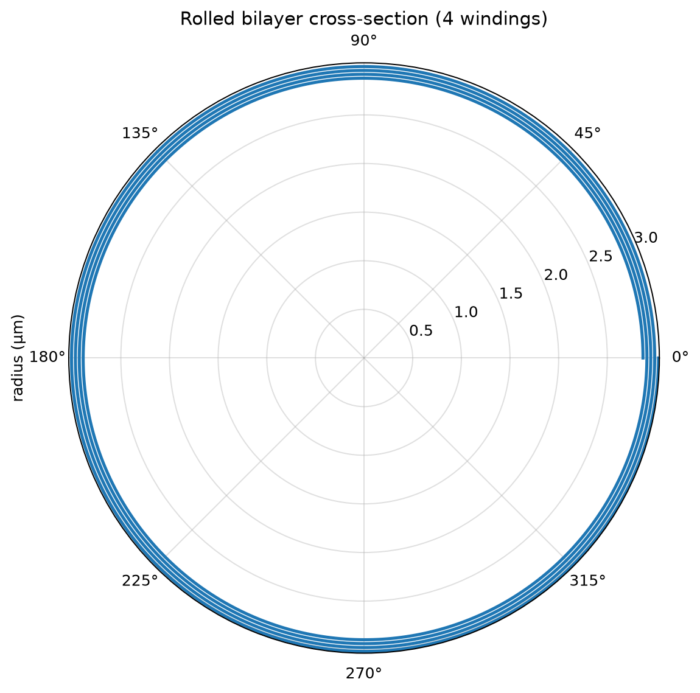
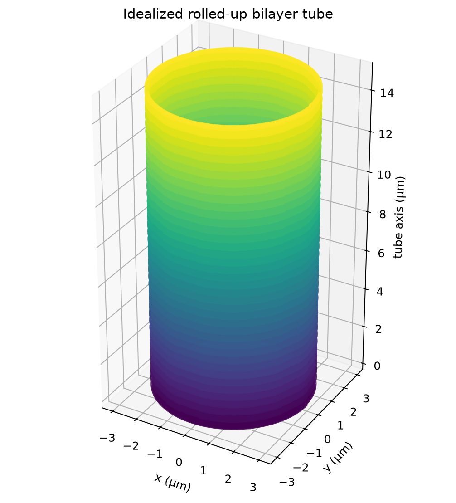
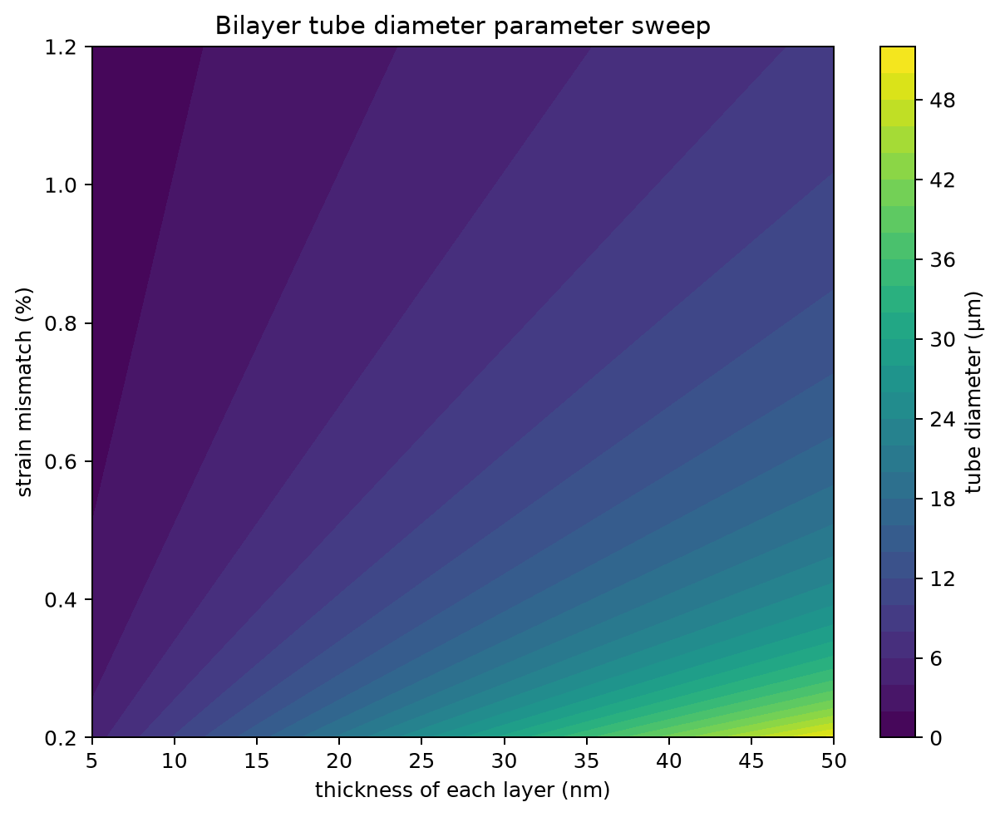

# Rolled-Up Membrane Simulator

This student portfolio project connects thin-film mechanics to visible tube geometries. It predicts the equilibrium curvature of a bonded, strained bilayer, draws the rolled edge as a 2D spiral, renders an idealized 3D tube, and sweeps design parameters to show how thickness and strain control tube diameter.

## Why a flat membrane rolls

Two nanoscale films are grown while bonded to a substrate. One layer would naturally like to be longer than the other, but the substrate and the bond between them keep both layers flat. This stores elastic energy. When a sacrificial layer underneath is etched away, the membrane is free to move. It bends so that one layer follows the outside of the curve and the other follows the inside, reducing the mismatch in their preferred lengths.

```text
Before release                     After release

layer 2  ===================       layer 2       /------\
layer 1  -------------------   ->  layer 1      /        \
support  ###################                  rolled tube
          sacrificial layer

Different preferred lengths + bonding -> bending after the support is removed
```

The calculation uses the full two-layer composite-beam form of the Timoshenko bimetal-strip model. A plane-strain switch reproduces the specialized equal-layer equation used by Cendula and co-workers. The plots are idealized geometry: they do not model etching dynamics, wrinkles, cracking, adhesion, or plastic deformation.

## Install

Python 3.10 or newer is recommended. From the project folder on Windows:

```powershell
python -m venv .venv
.venv\Scripts\Activate.ps1
python -m pip install -r requirements.txt
```

On macOS or Linux, activate with `source .venv/bin/activate` instead. Jupyter is included so the functions can also be explored interactively with `jupyter lab`.

## Run

```powershell
python tests.py
python plot_spiral.py --windings 4
python plot_3d_tube.py --windings 4 --length-um 15
python parameter_sweep.py
```

Images are written to `outputs/`. Run `python plot_spiral.py --help` or `python plot_3d_tube.py --help` for available options.

## Example results

### Rolled membrane cross-section



The polar plot shows the membrane edge after four windings. Its starting radius
comes from the calculated elastic equilibrium radius. The radial distance then
increases by one complete bilayer thickness per revolution, producing an
Archimedean spiral whose neighboring turns do not overlap.

### Three-dimensional rolled tube



The 3D view extends the same spiral cross-section along the tube axis. It is an
idealized geometric rendering: it communicates the rolled architecture but
does not include edge wrinkling, cracking, or changes during sacrificial-layer
etching.

### Thickness and strain parameter sweep



The contour plot evaluates the curvature model over many equal-layer designs.
Moving toward thicker layers increases tube diameter because a thicker bilayer
is harder to bend. Increasing strain mismatch has the opposite effect: the
larger difference in preferred layer lengths drives stronger curvature and a
smaller tube diameter.

## Research connection

Rolled-up nanomembrane self-assembly was developed extensively by Oliver G. Schmidt's group at IFW Dresden and, later, MAIN at Chemnitz University of Technology. Their work shows how deliberately stored strain can turn lithographically defined flat films into micro- and nanotubes, enabling devices such as resonators, sensors, microjets, and compact energy-storage structures. The numerical checks here use the InGaAs/GaAs samples in [Cendula et al., *Experimental realization of coexisting states of rolled-up and wrinkled nanomembranes by strain and etching control*](https://doi.org/10.1021/nl502108q), with its accessible [arXiv preprint](https://arxiv.org/abs/1407.5811); broader context is given by [Mei et al., *Versatile Approach for Integrative and Functionalized Tubes by Strain Engineering of Nanomembranes on Polymers*](https://doi.org/10.1002/adma.200701589).

## More documentation

- [Physics study note](docs/PHYSICS.md)
- [Code overview](docs/CODE_OVERVIEW.md)

